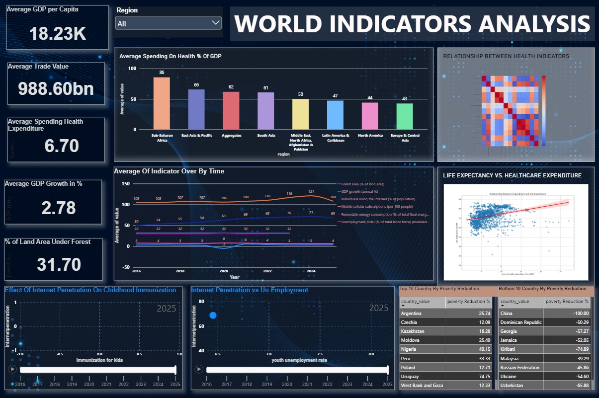
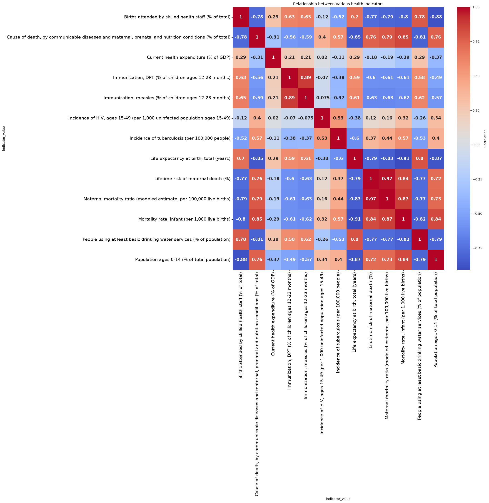
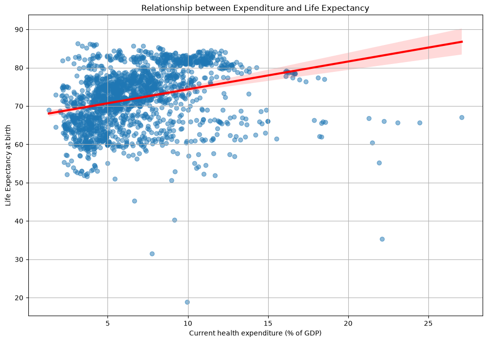

<h1 align="center">🌍 World Development Indicators — Global Analytics Dashboard</h1>

<p align="center">
  <b>An end-to-end data project: live World Bank API ➜ Python ETL ➜ Power BI dashboard</b><br>
  Tracking economy, health, poverty, trade, labour, environment and technology across <b>217 countries</b> (2016 – 2025)
</p>

<p align="center">
  
  
  
  
  
</p>

<p align="center">
  
</p>

---

## 📌 Project Overview

Most dashboards start from a ready-made CSV. **This one starts from raw API calls.**

I wrote a Python pipeline that pulls **26 development indicators** from the public **World Bank API**, handles pagination and rate limits, enriches each record with country metadata (region, income level, lending type, coordinates), and exports seven clean, analysis-ready datasets. These feed an interactive **Power BI dashboard** that includes embedded **Python (Seaborn) visuals** for statistical analysis.

**The questions it answers:**
- 💰 How do GDP growth and GDP per capita differ across regions and over time?
- 🏥 Does higher healthcare spending actually buy longer life expectancy?
- 📉 Which countries reduced poverty the most, and which the least?
- 🌐 Is internet penetration linked to youth unemployment and childhood immunisation?
- 🌳 How much land is under forest, and how much energy is renewable?

---

## 🏗️ Architecture

```
 ┌──────────────────┐     ┌────────────────────────┐     ┌──────────────────┐     ┌──────────────────────┐
 │  World Bank API  │ ──► │  Python ETL (requests, │ ──► │  7 clean CSVs    │ ──► │  Power BI Dashboard  │
 │  countries +     │     │  pandas) — paginate,   │     │  (one per theme) │     │  KPIs · slicers ·    │
 │  26 indicators   │     │  filter, merge, export │     │                  │     │  Python visuals      │
 └──────────────────┘     └────────────────────────┘     └──────────────────┘     └──────────────────────┘
```

---

## 📊 Dashboard Highlights

**Headline KPIs (all regions, 2016 – 2025)**

| 💰 Avg GDP per Capita | 📈 Avg GDP Growth | 🚢 Avg Trade Value | 🏥 Health Spend (% GDP) | 🌳 Land Under Forest |
|:---:|:---:|:---:|:---:|:---:|
| **$18.23K** | **2.78 %** | **$988.6 bn** | **6.70 %** | **31.70 %** |

| Visual | What it shows |
|---|---|
| **Region slicer** | Filters every visual in the report by World Bank region |
| **Average of indicators over time** | Year-by-year trends for internet use, mobile subscriptions, GDP growth, unemployment, forest area and renewable energy |
| **Health indicators by region** | Column chart comparing regions, from Sub-Saharan Africa to Europe & Central Asia |
| **🐍 Relationship between health indicators** | Seaborn correlation heatmap, written in Python and embedded directly in Power BI |
| **🐍 Life expectancy vs. healthcare expenditure** | Seaborn regression plot with a trend line |
| **Top 10 / Bottom 10 by poverty reduction** | Countries ranked by change in poverty headcount (custom DAX measure) |
| **Animated scatter plots** | Internet penetration vs. youth unemployment and vs. childhood immunisation, with a play axis from 2016 to 2025 |

---

## 🔍 Key Insights

<p align="center">
  
</p>

- **Infant mortality and life expectancy move almost perfectly in opposite directions (r = −0.91).** Child survival is the single strongest signal of overall population health.
- **Clean drinking water matters as much as hospitals.** Access to basic drinking water correlates **+0.80** with life expectancy and **−0.82** with infant mortality.
- **Skilled birth attendance is a major lever.** Correlation with maternal mortality is **−0.79**.
- **Younger populations signal weaker health systems.** The share of population aged 0–14 correlates **−0.87** with life expectancy.
- **DPT and measles immunisation rates track together (r = 0.89).** Vaccination programmes tend to succeed or fail as a package.

<p align="center">
  
</p>

- **Spending alone is not enough.** Health expenditure as a % of GDP has only a **weak positive link (r ≈ 0.29)** with life expectancy. Several high-spending countries still sit below 70 years, so *how* money is spent matters more than *how much*.


**From the dashboard trends:**
- 🌐 **The digital jump.** Internet users rose from **50 % to 71 %** of the population between 2016 and 2024, and mobile subscriptions climbed from **105 to 121 per 100 people** before dipping in 2025.
- 🦠 **The COVID shock is clearly visible.** Average GDP growth turns negative in **2020** and rebounds sharply in **2021**.
- 📉 **Poverty reduction is uneven.** Uruguay (**74.7 %**), Nigeria (**40.2 %**) and Peru (**33.3 %**) lead the Top 10, while several countries show large swings in the other direction.
---

## 🧾 Indicators Collected (26)

| Theme | Indicators |
|---|---|
| **Economic** | GDP growth (annual %), GDP per capita (current US$) |
| **Labour market** | Unemployment total %, youth unemployment (15–24) %, total labour force |
| **Trade** | Exports and imports of goods & services (US$) |
| **Poverty & inequality** | Poverty headcount at national lines, Gini index |
| **Environment** | Renewable energy consumption %, forest area % |
| **Health** | Life expectancy, infant mortality, maternal mortality, basic drinking water, health expenditure % GDP, DPT & measles immunisation, TB & HIV incidence, skilled birth attendance, lifetime maternal-death risk, communicable-disease deaths, population 0–14 |
| **Technology** | Internet users %, mobile subscriptions per 100 |

A full catalogue of **29,000+ World Bank indicator codes** was also scraped and saved as `data/raw/indicator_catalog.csv` for future extensions.

---

## 📁 Repository Structure

```
world-development-indicators-dashboard/
├── dashboard/
│   └── World_Indicators_Dashboard.pbix     # Power BI report
├── data/raw/
│   ├── economic.csv            ├── health.csv
│   ├── labour_market.csv       ├── technology.csv
│   ├── trade.csv               ├── environmental.csv
│   ├── poverty_inequality.csv  └── indicator_catalog.csv
├── notebooks/
│   └── 01_api_data_collection.ipynb        # exploration + EDA
├── scripts/
│   └── fetch_worldbank_data.py             # clean end-to-end ETL script
├── images/                                  # screenshots used in this README
├── requirements.txt
└── README.md
```

---

## ⚙️ How to Run

```bash
# 1. Clone
git clone https://github.com/<your-username>/world-development-indicators-dashboard.git
cd world-development-indicators-dashboard

# 2. Install dependencies
pip install -r requirements.txt

# 3. Re-fetch the latest data from the World Bank API (optional; CSVs are included)
python scripts/fetch_worldbank_data.py

# 4. Open the dashboard
#    dashboard/World_Indicators_Dashboard.pbix  →  Power BI Desktop (free, Windows)
```

> **Note:** The embedded Python visuals need Python enabled in Power BI Desktop
> (*File → Options → Python scripting*) with `pandas`, `seaborn` and `matplotlib` installed.

---

## 🛠️ Tech Stack

- **Data source:** World Bank Open Data REST API
- **ETL:** Python · `requests` · `pandas` · `numpy` (pagination, JSON normalisation, filtering to 2016+, joins with country metadata)
- **Analysis:** `seaborn` · `matplotlib` (correlation matrix, regression)
- **BI:** Power BI Desktop (DAX measures, slicers, KPI cards, embedded Python visuals)

---


## 👤 Author

**Prince Raj**
📧 spunkyiitj@gmail.com 

⭐ *If you found this project useful, consider giving it a star!*


